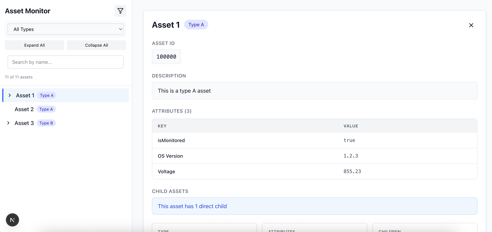
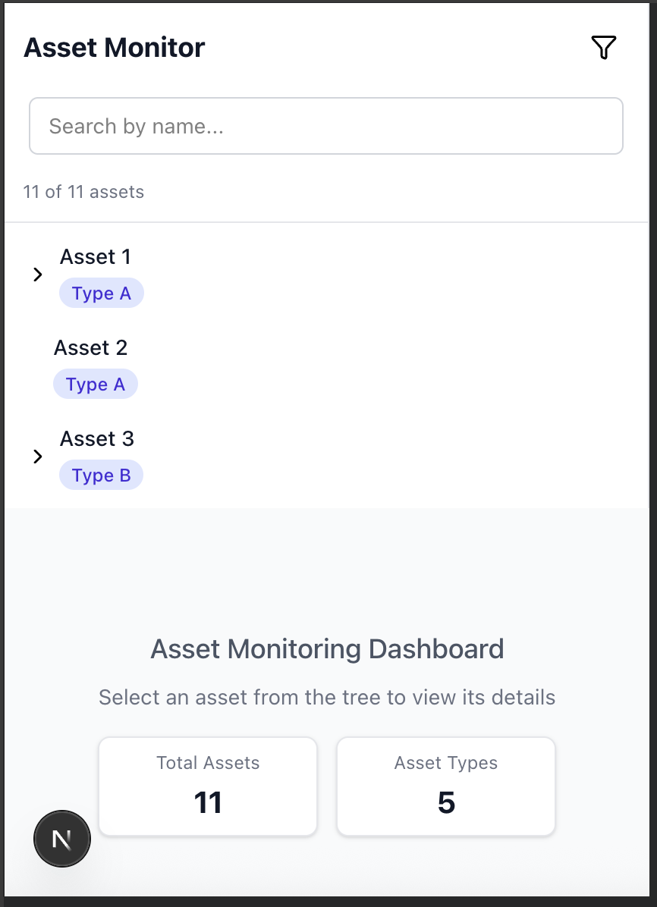

# Asset Monitoring (Next.js)

A Next.js app for exploring and viewing nested assets - EA Technology Interview

## Prerequisites
- Node.js `>= 18.18` (LTS recommended)
- npm (or yarn/pnpm/bun; commands below use npm)

## Installation
npm install

## Running Locally
npm run dev

Then open `http://localhost:3000/` in your browser.

## Build and Static Export
This project is configured with `output: "export"` in `next.config.ts`, which generates a static site suitable for any web server.

1) Build the app:
npm run build

2) Export static files to the `out/` directory:
npm run export

## Tech Stack
- ⚡ **Next.js** – React framework for building fast, server-side rendered and static web apps  
- 🧩 **TypeScript** – Strongly typed JavaScript for safer, cleaner, and more maintainable code  
- 🎨 **Tailwind CSS** – Utility-first CSS framework for responsive and elegant UI design  
- 🧪 **Vitest** – Lightning-fast unit testing framework powered by Vite  
- 💎 **Lucide React** – Beautiful, consistent open-source icons for modern React apps

## Live Demo
[Click here](https://demo.vivekrajelango.in)

Desktop

Mobile

